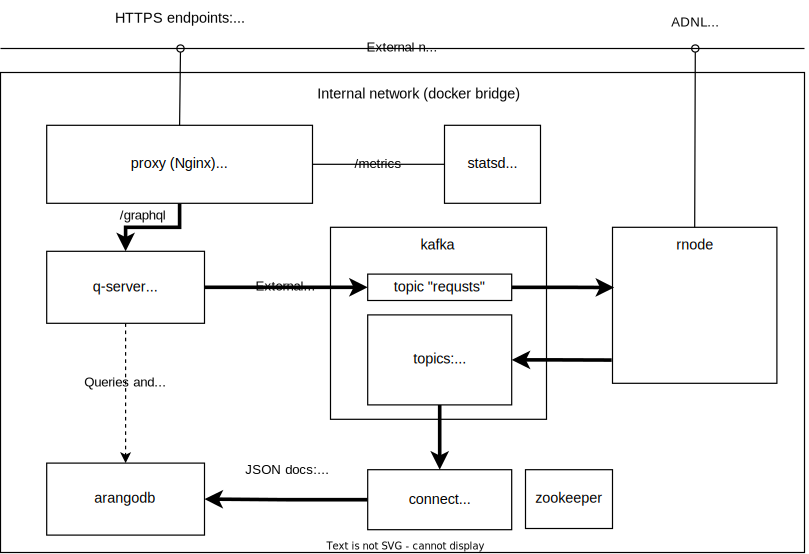

# Evernode DApp Server (DS)
[Evernode Dapp Server](https://docs.evercloud.dev/products/dapp-server-ds) is a community (open source) version of [Evernode Platform](https://docs.evercloud.dev/) (client supernode with GraphQL API) for TVM blockchains (Everscale, Venom, TON, Gosh)  that exposes [GraphQL API](https://docs.evercloud.dev/reference/graphql-api).


Compatible with [ever-sdk](https://github.com/tonlabs/ever-sdk), [everdev](https://github.com/tonlabs/everdev), [everscale-inpage-provider](https://github.com/broxus/everscale-inpage-provider), [evescale-standalone-client](https://github.com/broxus/everscale-inpage-provider) and other libraries and tools for TVM blockchains. 

 

This HOWTO contains instructions on how to build and configure your own free instance of Evernode Platform to connect your application to Everscale. The instructions and scripts below were verified on Ubuntu 20.04.

# Table of Contents
- [What is Evernode Dapp Server?](#what-is-evernode-dapp-server)
- [Overview of technical architecture](#overview-of-technical-architecture)
- [Getting Started](#getting-started)
  - [1. System Requirements](#1-system-requirements)
  - [2. Prerequisites](#2-prerequisites)
    - [2.1 Set the Environment](#21-set-the-environment)
    - [2.2 Install Dependencies](#22-install-dependencies)
    - [2.3 Deploy Full Node](#23-deploy-full-node)
- [Check Node synchronization status](#Check-Node-synchronization-status)
- [Stopping, restarting and deleting DApp Server](#stopping-restarting-and-deleting-dapp-server)
- [Redeploying DApp Server](#redeploying-dapp-server)

# What is Evernode Dapp Server?

Evernode DS is a set of services enabling you to work with Everscale blockchain.

The core element of Evernode DS is [Everscale node written in Rust](https://github.com/tonlabs/ton-labs-node) focused on performance and safety.\
Evernode DS is a set of services serving EVER SDK GraphQL endpoint:
 - [Everscale GraphQL Server](https://github.com/tonlabs/ton-q-server) (aka Q-Server) for serving GraphQL queries.
 -  Scalable multi-model database [ArangoDB](https://www.arangodb.com/documentation/) with the information about all blockchain entities (like accounts, blocks, transactions, etc.) stored over time
 - A high-throughput, low-latency streaming platform [Kafka](https://kafka.apache.org/documentation/) for communication between services.
 - StatsD exporter to collect and export metrics to Prometheus 

All the Evernode DS services can be easily deployed with Docker/Docker Compose wrapped into unix shell scripts, provided below.

> **Note**: Rust node is included in the Evernode DS, and doesn't have to be installed separately.

# Overview of technical architecture

All system components run as docker containers inside one docker bridge network and are shown in the diagram below:



# Getting Started

## 1. System Requirements
| Configuration | CPU (cores) | RAM (GiB) | Storage (GiB) | Network (Gbit/s)|
|---|:---|:---|:---|:---|
| Recommended |24|128|2000|1| 

DApp Server is storage I/O bound, so NVMe SSD disks are recommended for the storage.

**Note**: To connect to a DApp Server you are running with client applications (such as [TONOS-CLI](https://github.com/tonlabs/tonos-cli#21-set-the-network-and-parameter-values)), it should have a domain name and a DNS record. Then its URL may be used to access it.

## 2. Prerequisites
### 2.1 Set the Environment
Adjust (if needed) `evernode-ds/scripts/env.sh`:
- specify the network - use main.ton.dev for the main network and net.ton.dev for the developer network
- specify notification email

Set environment variables:

    $ cd ./scripts/
    $ . ./env.sh 


### 2.2 Install Dependencies
Ubuntu 20.04:

    $ ./install_deps.sh
    
**Note**: Make sure to add your user to the docker group, or run subsequent command as superuser:


    sudo usermod -a -G docker $USER


### 2.3 Deploy Full Node
Deploy full node:

    $ ./deploy.sh 2>&1 | tee ./deploy.log


**Note**: the log generated by this command will be located in the `evernode-ds/scripts/` folder and can be useful for troubleshooting.

# Check Node synchronization status

Use the following command to check if the node is synced:

    docker exec rnode /ton-node/tools/console -C /ton-node/configs/console.json --cmd getstats

Script output example:
```
tonlabs console 0.1.286
COMMIT_ID: 5efe6bb8f2a974ba0e6b1ea3e58233632236e182
BUILD_DATE: 2022-10-17 02:32:44 +0300
COMMIT_DATE: 2022-08-12 00:22:07 +0300
GIT_BRANCH: master
{
	"sync_status":	"synchronization_finished",
	"masterchainblocktime":	1665988670,
	"masterchainblocknumber":	9194424,
	"node_version":	"0.51.1",
	"public_overlay_key_id":	"S4TaVdGitzTApe7GFCj8DbuRIkVEbg+ODzBxhQGIUG0=",
	"timediff":	6,
	"shards_timediff":	6,
	"in_current_vset_p34":	false,
	"in_next_vset_p36":	false,
	"last_applied_masterchain_block_id":	{"shard":"-1:8000000000000000","seq_no":9194424,"rh":"ff88c27c9bc65762da222d6c14a163a96f7c74b65d1930735e23266a3b07ee8b","fh":"208bf95293feec1afdfdbd65a63c5f3ac4cd6a6fa15ac9e4e88fbfbd6a883edc"},
	"processed_workchain":	"masterchain",
	"validation_stats":	{},
	"collation_stats":	{},
	"tps_10":	2,
	"tps_300":	2
}
```
If the `timediff` parameter is less than 10 seconds, synchronization with masterchain is complete.
`"sync_status": "synchronization finished"` means synchronization with workchains is complete

**Note**: The sync process may not start for up to one hour after node deployment, during which this command may result in error messages. If errors persist for more than an hour after deployment, review deployment log for errors and check the network status.


# Stopping, restarting and deleting DApp Server

**Note**: call docker-compose commands from the `evernode-ds/docker-compose/ton-node` folder.
    
To stop the node use the following command:

    docker-compose stop

To restart a stopped node use the following command:
    
    docker-compose restart

To remove the node use the following commands:
    
    docker-compose down
    git reset --hard origin/master
    git clean -ffdx
    
**Warning**: all local files and changes will be deleted from the git tree.

# Redeploying DApp Server

Before redeploying DApp server, make sure to remove the node and reset the git branch:
    
    cd evernode-ds/docker-compose/ton-node
    docker-compose down
    git reset --hard origin/master
    git clean -ffdx

Otherwise redeployment will fail.
When the branch is reset, repeat steps 2.1 - 2.3.
